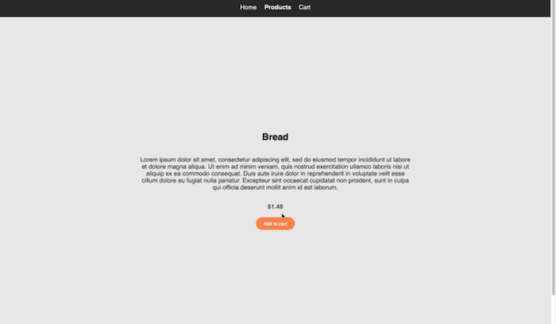

<h1 align="center">eCommerce Site</h1>

Client-side eCommerce web application built with React

## Demo

## About

Simple eCommerce SPA that uses mock data retrieved from a local database using to display grocery products. The application features the ability to:

- add items to cart
- remove items from cart
- filter items by price
- calculate a subtotal cost

This application was built using:

- React
- SASS
- React Router
